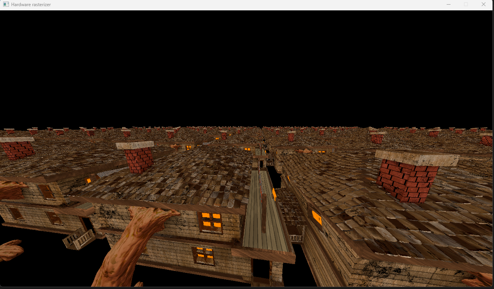

# TFG-Real-time-rendering

This project consists on three rendering engines that I made for my final project in University, each one being a rasterizer with explores some aspect of real-time rendering.

My final project consisted on an overview of most elemental real-time graphics algorithms, as well as explainings it's limitiation on implementing them on CPU and the reasons why GPU is much better for this kind of task, so the projects are mostly examples that ilustrates the conclusions of the documentation, thats why I've chosen to left the projects as their are, and possibly expanding it's concepts in new projects that I will make.

The projects are:

- Software rasterizer. This was the main topic as I used it to document different algorithms that exists in real-time rasterizer, such as vertex processing, triangle rasterization and cull-mapping. The project support parallelization in the vertex processing which significally improves the performance but is still far from the others.
- Hardware rasterizer. I made this project in order to make an introduction to opengl development, supporting modern opengl core features but is a pretty simple renderer, the main reason to exits is to compare performance with software rasterizer.
- Basic PBR rendering where you can tweak material paramteres in order to make different physics materials to a teapot (or any untextured mesh) and see how they behave with a light source.

| Software rasterizer was struggling with a single mesh | Harware rasterizer could run up to 100 meshes without any optimization before getting performance penalty |
| - | - |
|  |  |

The PBR renderer let you tweak different material properties that affected how light behaves to the object.
|  |  |
| - | - |
|  |   |
|  |   |

## Building the project

I have refactored the projects in order to be able to build them on windows using cmake and MSBuild, however I do not still support building the projects for other platforms, altough it won't be extremly difficult to tweak them in order to be able to do that.

All projects have scripts to compile and run them with MSBuild, however I don't have a script for generating the MSBuild projects from CMake as I do that from Visual Studio Code Cmake extension.
